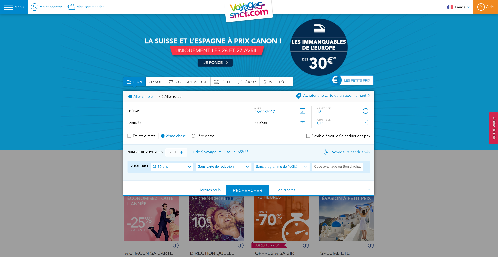

# Front end TP

Ce TP a pour objectif de se familiariser avec l'intégration HTML/CSS tout en apprenant à organiser son code de manière modulaire en s'inspirant de la méthode [Atomic Design](http://bradfrost.com/blog/post/atomic-web-design/) (pour plus de détails, cf. [son livre disponible gratuitement](http://atomicdesign.bradfrost.com/))

L'environnement de développement est basé sur [Pug-Sass Boilerplate Starter Kit](https://github.com/Errec/pug-sass-boilerplate-starter-kit)

La cible de l'intégration est la homepage du site [VOYAGES SNCF](https://www.voyages-sncf.com/) qui est propice à un découpage modulaire. 

## Installation

> Prérequis : installer Git, Nodejs (tester sur v6.9.0 et npm 3.10.8) ou nvm

1. cloner le repository où vous le voulez
2. dans le dossier projet :
  - supprimer le dossier .git
  - `npm install` (`npm start` sera lancé automatiquement après l'installation)
  
## Démarrer le projet

`npm start`

Cette commande lance :

1. `npm run build` : compile les fichiers `.pug` et `.scss` puis génère un build du site statique dans `./build`
2. `npm run watch` : surveille les changements sur les fichiers `.pug` et `.scss` et relance la compilation
3. `npm run serve` : lance un serveur http avec `http-server` et ouvre un navigateur sur `http://localhost:3000`

## Modifier le projet

Dans ce TP vous n'avez besoin de modifier que les fichiers `.pug` et `.scss` dans les dossiers `atoms`,`molecules`,`organisms` dans  `src/components`.

Vous pouvez également y créer de nouveaux dossiers contenant un fichier `<nom du dossier>.pug` et `<nom du dossier>.scss`.

Vous aurez aussi besoin de modifier le fichier `src\index.scss` pour importer les fichiers `.scss` que vous aurez créés.